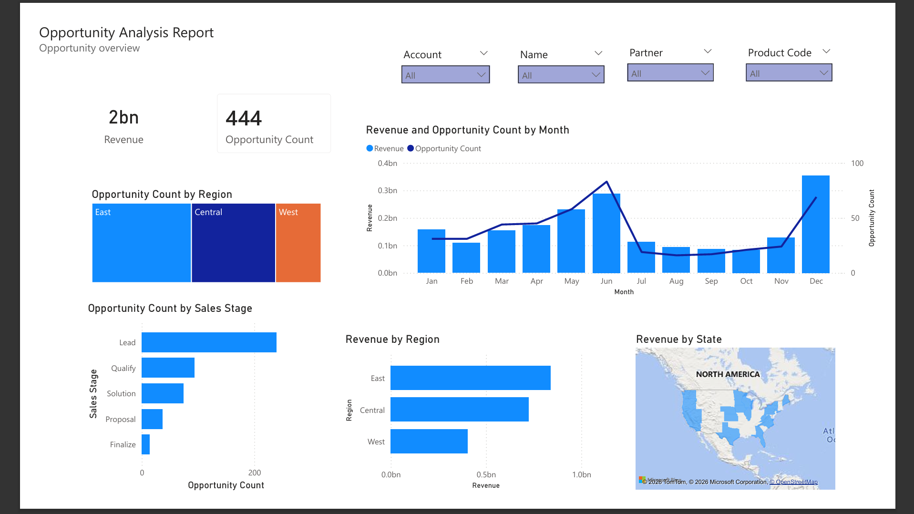
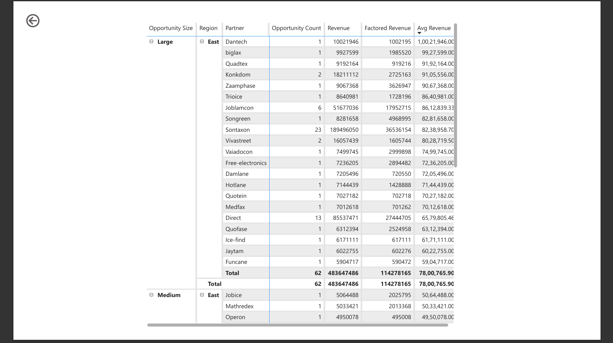
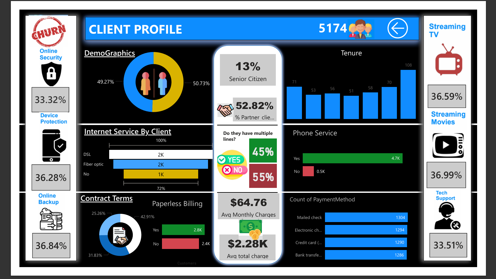
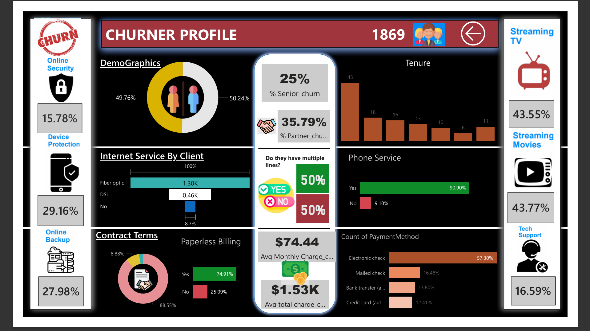

# PowerBI-Projects

SQL + Power BI project: Opportunity Analysis & Telecom Churn Risk dashboards with data-driven insights.

Built during a Data Science Internship at Nirvaa Solutions Pvt. Ltd., using Oracle SQL for data querying/analysis and Power BI for dashboard design.

## 1. Opportunity Analysis Report

Objective: Track sales opportunities across regions, partners, and sales stages to identify revenue trends and pipeline health.

Tools: Oracle SQL, Power BI

Key Insights:

Total revenue of ~2bn across 444 opportunities
Revenue peaked in June and December, with a mid-year dip (Jul–Sep)
East region leads in both opportunity count and revenue
Most opportunities are concentrated in the "Lead" and "Qualify" stages, with a sharp drop-off toward "Finalize" — signaling potential pipeline leakage
Strategic-segment clients contribute the highest revenue share (877M), ahead of Large (619M) and Small & Medium (472M)

Screenshots:

 

📄 Full Report (PDF) | 📊 Power BI File

## 2. Telecom Churn Risk Analysis

Objective: Analyze customer demographics and service usage patterns to identify factors driving churn, comparing retained clients vs. churners.

Tools: Oracle SQL, Power BI

Key Insights:

Churn rate is notably higher among senior citizens (25% vs. 13% in the retained base)
Churners are far more likely to use Fiber optic internet (100% vs. mixed DSL/Fiber split for retained clients)
Paperless billing is much more common among churners (75%) than retained clients (54%)
Electronic check is the dominant payment method for churners (57%), compared to a more even spread among retained clients
Includes an interactive "Ask a Question" Q&A feature for natural-language querying of the dataset

Screenshots:

  

📄 Full Report (PDF) | 📊 Power BI File

Skills Demonstrated
> Data querying and analysis using Oracle SQL
> Dashboard design and DAX measures in Power BI
> Business insight generation from raw data
> Customer segmentation and churn risk profiling
